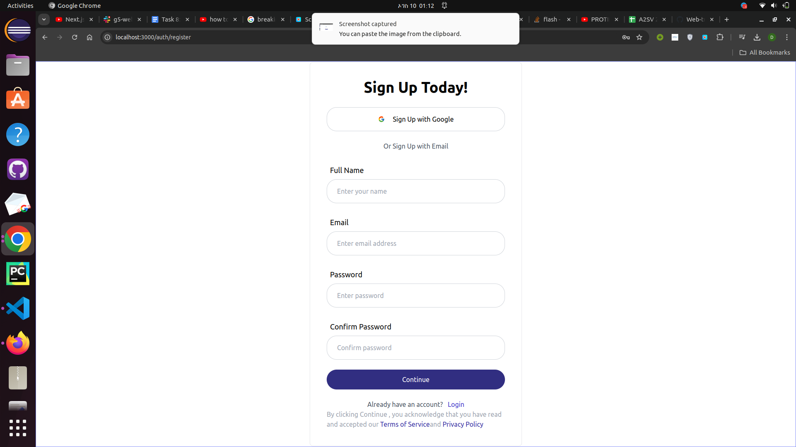
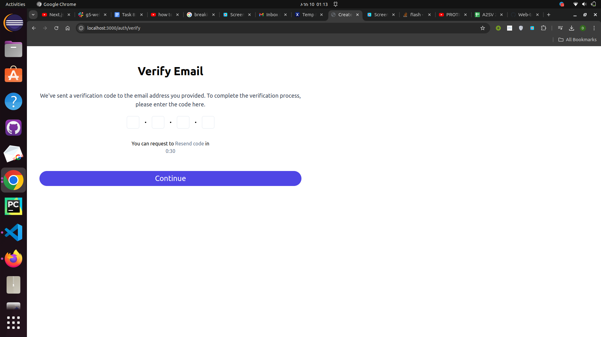

## Next Auth
  authentication functionality using NextAuth in your application, including signup and signin pages, and integrate with provided API endpoints for user registration and authentication.

## features
  Sign up
  Login with credential
  Client side form validation
## Technologies Used
Next.js: Leverage the power of this popular React framework to build a performant and scalable application.
TypeScript: Enjoy the benefits of static typing and improved developer experience.
Tailwind CSS: Rapidly style your application with this utility-first CSS framework.
NextAuth: Integrate this powerful authentication library to handle all your authentication needs.
Installation
Clone the Repository
```
https://github.com/dura12/Web-development-track.git
```
Navigate to the Project Directory
```

```
2 . Navigate to the project directory:

```
cd test-next-auth
```
3 . Install the necessary dependencies:
```
npm install
```
4 . Start the development server:
```
`npm run dev
```
 SIGNIN PAGE


SIGN UP PAGE



VERIFICATION PAGE



Demo
[VIDEO](./public/recording (4).webm)
